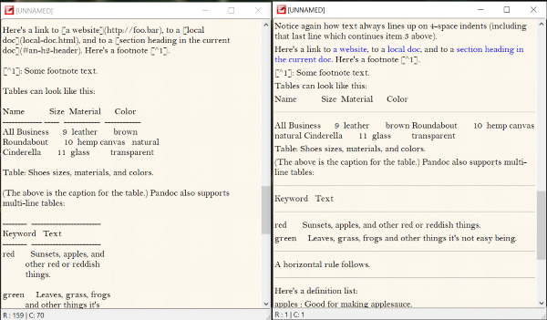

# Note

This is a simple text editor created using Qt C++. This editor works entirely on keyboard commands with minimize, maximize and close button as some exceptions.   

- Two main Qt classes used are: 
  - [QMainWindow](https://doc.qt.io/qt-5/qmainwindow.html) 
  - [QTextEdit](https://doc.qt.io/qt-5/qtextedit.html) 
 
This editor supports processing of rich text but cannot load the files directly that are in rich text format. 

  
Windows_deployment folder contains the DLL files that are needed to run the executable in windows without any Qt environment setup. 
